# MotorbikeStore - E-commerce website built with java (jsp/servlet), html/css (bootstrap), jdbc, MySQL

## Introduction

Here is my source code for building an e-commerce website used to introduce and sell motorbikes in a store. 
After studying a web programming course at my university, my group and I wanted to build a web application to apply our knowledge in a real project to understand more about web programming and try building an efficient project for customers who are in need. We did a large number of research on many topics and we realized that many motorbike stores have not had their website but they seem to have demand for this technology so we want to build this website for those customers as well as to help them introduce their products visually and promote sales. We not only applied web programming knowledge on this project but also continued to update with some web security, some design patterns,... And now I'm in the progress of updating this to enhance the project to be better and more effective.

  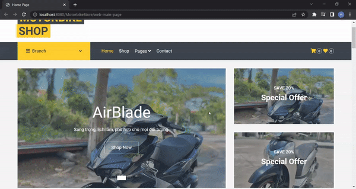
  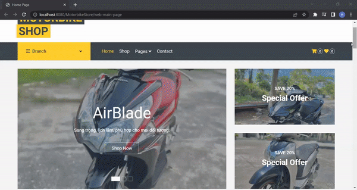
  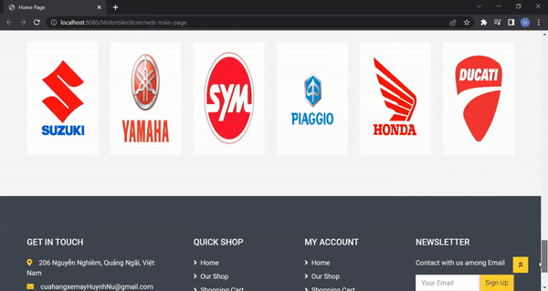
  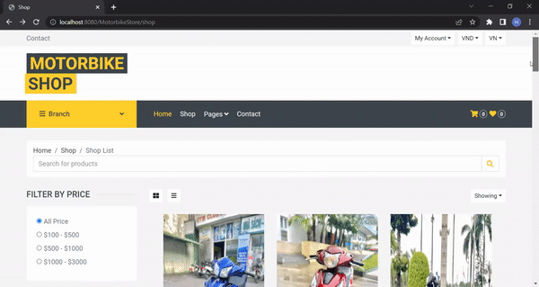 
  
  
  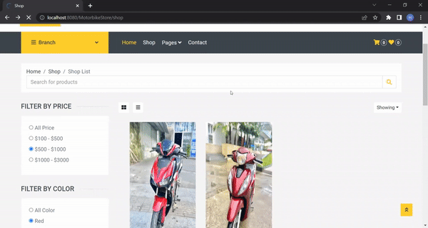
   
  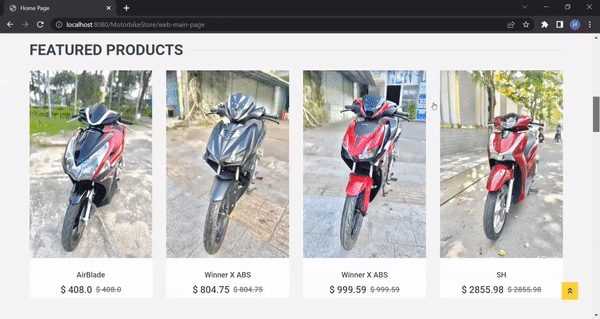
  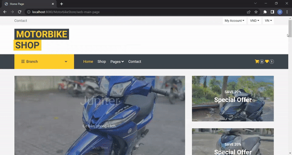
  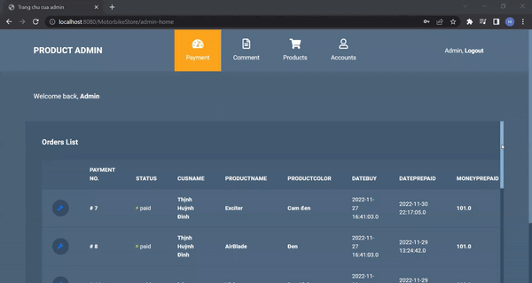
  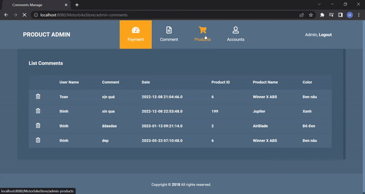 
  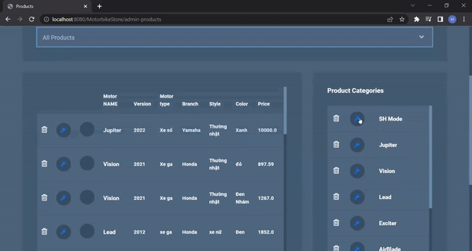
  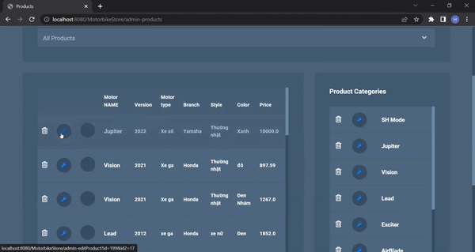
  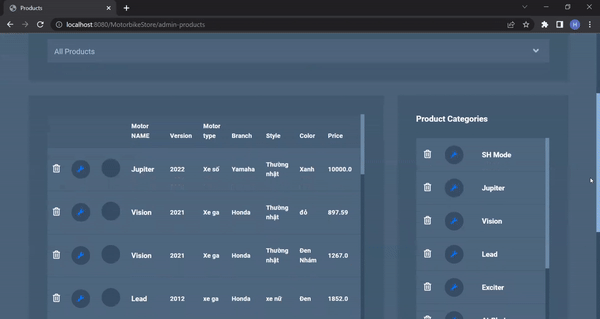
  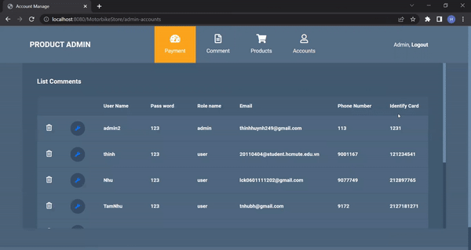 
  <i>Sample results</i>

## Usecase diagram

  <i>Usecase diagram</i> 
  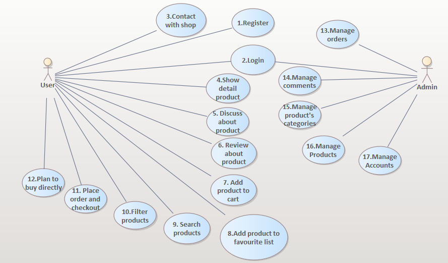 
  <i>Link requirement modeling: https://docs.google.com/document/d/1A_l-G4DdyuuDWZijfDaK-KKGS3IX7d5YfKWeXW2-wrk/edit?usp=sharing </i> 

## Some main functions

* **Register, Login**
* **Search products**
* **Filter list of products (by price, color,...)**
* **Add product to cart or favorite list**
* **Comment/Review about products**
* **Contact with shop owner**
* **Plan for buying directly/Place an order**
* **Manage products (CRUD pictures), user's accounts, comments,and orders (CRUD)**

## How to use my code 

With my code, you can :

* **Clone project: git clone https://github.com/HdThinh6102git/MotorbikeStoreWebsite/**
* **Import project into Eclipse**
* **Update maven project**
* **Import sql file into MySQL**
* **Change database connection in the following path src/main/java/com/MotorbikeStore/dao/impl/DBConnection.java**
* **Create a Tomcat server**
* **Run project on server**
 
## Requirements

* **Java 8**
* **Mysql 8.0**
* **Tomcat 8.5**
* **IDE: Eclipse(2022), Netbean, Intellij** 

## Acknowledgements
I express my sincere thanks to the teachers of HCMUTE and many online teachers on youtube (such as laptrinhjavaweb.com,...) who taught me lots of knowledge which I used to build this project.
